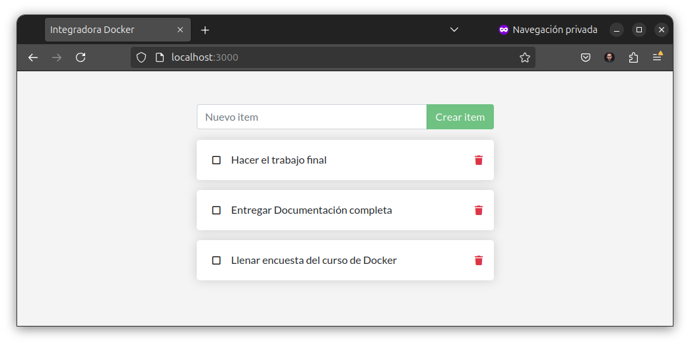
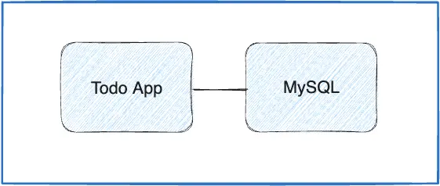

# Fundamentos y usos prácticos de Docker

[](https://docker.com/)
[](https://centro410laplata.edu.ar/)
[](https://idepba.com.ar/)
[](https://atepba.org.ar/)


## Trabajo integrador 🐳


En el presente trabajo integrador se evaluará:

- Conteinerizar una aplicación simple.
- Buildear la imagen y subirla a Docker Hub.
- Correr la aplicación multicontenedor usando docker compose.

> [!IMPORTANT]  
> Fecha límite de entrega 24/04/2026.

## Prerrequisitos

- Docker Desktop o Docker CLI
- Git (opcional).
- Un editor de texto (recomendado), como <a href="https://notepad-plus-plus.org/downloads/" target="_blank">Notepad++</a>, <a href="https://code.visualstudio.com/Download" target="_blank">VSCode</a> o <a href="https://vscodium.com/" target="_blank">VSCodium</a>.


### Forma de entrega

Subir el archivo `docker-compose.yml` en el [Campus Virtual IDEP](https://campus.idepba.com.ar) en la sección "Trabajo Final" del curso [Fundamentos y usos prácticos de Docker 2026 - 1](https://campus.idepba.com.ar/course/view.php?id=5)


## Parte 1 - Conteinerizar una Aplicación

Para este trabajo integrador, usaremos una app simple **todo list manager** que corre en Node.js y podemos levantarla en nuestro navegador web. Si no estás familiarizado con Node.js, no te preocupes, este trabajo integrador no requiere conocimientos de programación. Solo usaremos una app de ejemplo para poder armar las imágenes y correr los contenedores.



### 1. Obtener la aplicación

Antes de poder correr la aplicación, necesitamos obtener el código fuente y descargarlo.

- Clonar el repositorio usando el siguiente comando:

    ```bash
    git clone https://github.com/kity-linuxero/docker-integradora.git
    ```
- Si no tiene un cliente git instalado, puede descargar el repositorio del siguiente [link](https://codeload.github.com/kity-linuxero/docker-integradora/zip/refs/heads/main). Luego debe descomprimir el archivo zip.

- Una vez descargada la aplicación, deberías ver el código fuente de la misma con la siguiente estructura de directorios dentro de la carpeta `app`:

    ```
        app/
        ├─ spec/
        ├─ src/
        ├─ yarn.lock
        ├─ package.json
        ├─ Dockerfile
        ├─ .dockerignore
    ```


## Parte 2 - Modificar aplicación, generar imagen y correr contenedor

Haremos algunos cambios y actualizaremos la aplicación.

### 1. Actualizar el código fuente

- En el archivo `app/src/static/js/app.js` actualizaremos la **línea 56**, con los siguientes cambios: 

   ```diff
   - <p className="text-center">Aún no hay items. ¡Agrega tu primer item arriba!</p>
   + <p className="text-center">No hay nada en la lista! | by: [SU APELLIDO.NOMBRE]</p>
   ```

> Es importante que ponga su nombre y apellido en el archivo `app/src/static/js/app.js` para después saber quien hizo el trabajo integrador.


### 2. Preparar archivo Dockerfile para buildear la imagen

> [!TIP]
> Consulte apuntes de <a href="https://docker.idepba.com.ar/clase3.html#/docker_build" target="_blank">docker build</a>.

- El archivo `Dockerfile` se encuentra en la carpeta `app` con el siguiente contenido:

    ```dockerfile
    # Usamos la imagen base de Alpine Linux
    FROM node:18-alpine

    # Establecemos el directorio de trabajo
    WORKDIR /app

    # Copiamos los archivos del proyecto al contenedor
    COPY . .

    # Instalamos las dependencias del proyecto
    RUN yarn install

    # Exponemos el puerto de la aplicación
    EXPOSE 3000

    # Comando por defecto para ejecutar la aplicación
    CMD ["node", "src/index.js"]
    ```

Proceda a buildear la imagen con el siguiente comando:

```bash
docker build -t <NOMBRE_IMAGEN> .
```

> [!TIP]
> El `Dockerfile` puede ser mejorado. Es opcional. Pero si lo desea puede investigar como mejorar el `Dockerfile` con **multi-stage build** para reducir el tamaño de la imagen final.


### 3. Correr la aplicación

Una vez creada la imagen, debería ser capaz de correr la aplicación. Con el siguiente comando:

```bash
docker run -d -p 3000:3000 --name todo-app <NOMBRE_IMAGEN>
```

Por ejemplo:

```bash
docker run -p 3000:3000 --name todo-app todo-app:v1
```

Y debería mostrar algo como:

```bash
Using sqlite database at /etc/todos/todo.db
Listening on port 3000
```

Si todo está ok, podría acceder a la aplicación en [http://localhost:3000](http://localhost:3000).


- Detenga y elimine el contenedor de la aplicación con el siguiente comando:

    ```bash
    docker rm -f todo-app
    ```


## Parte 3 - Compartir app

Para compartir la imagen de la aplicación usaremos la registry de [DockerHub](https://hub.docker.com/).

> [!TIP]
> De ser necesario, repase lo realizado en el [Laboratorio 2.4](https://github.com/kity-linuxero/docker_410_practicas/blob/v1.5/labs/02-conceptos-basicos/24-images-push.md).


> [!IMPORTANT]
> Debe volver a buildear la imagen y subirla a DockerHub para aprobar el trabajo integrador.


## Parte 4 - Aplicaciones multicontainer

A continuación agregaremos un segundo contenedor para que sea de base de datos basada en `MySQL`.



### Base de datos MySQL

Usaremos una imagen basada en MySQL. La imagen será `mysql:8.0`. Para poder iniciar y tener la configuración sobre la base de datos, usaremos *variables de entorno*. 

Para mas info consulte la sección _variables de entorno_ de [Docker Hub MySQL](https://hub.docker.com/_/mysql/).

### Configuración

A modo de resumen, tendremos que configurar las siguientes variables de entorno para el contenedor de base de datos:

**Variables de entorno para el contenedor de base de datos:**

- `MYSQL_ROOT_PASSWORD`: La password del usuario root de la base de datos. Utilice la password de su preferencia.
- `MYSQL_DATABASE`: La base de datos que utilizaremos. Elija un nombre de su preferencia, por ejemplo `todos`.


**Variables de entorno para la aplicación:**

- `MYSQL_HOST`: Hostname donde corre el servidor MySQL. Coincidir con el **nombre del servicio** o con el `container_name` de la base de datos.
- `MYSQL_USER`: El usuario para la conexión.
- `MYSQL_PASSWORD`: La password utilizada para la conexión.
- `MYSQL_DB`: La base de datos que se utilizará una vez conectada la aplicación.

>Consulte [src/persistence/mysql.js](https://github.com/kity-linuxero/docker-integradora/blob/main/app/src/persistence/mysql.js) para mas información.


### Persistencia de datos

Genere un volumen para persistir los datos de la base de datos. El punto de montaje es `/var/lib/mysql`.

## Parte 5 - Generando el Docker Compose

Crear el archivo `docker-compose.yml` con toda la configuración necesaria para que levante la aplicación y la base de datos. Con las variables de entorno configuradas, la imagen subida a Docker Hub y el volúmen para persistir los datos de la base de datos.

> [!TIP]
> Puede ser de utilidad el sitio [composerize](https://www.composerize.com/) o con una herramienta de IA de su preferencia.


> [!IMPORTANT]  
> La `image` del `docker compose` debe tomar como origen la imagen que ha subido a Docker Hub con su usuario.

> [!IMPORTANT]  
> Tener en cuenta que los datos deben persistir en el contenedor de base de datos. Por lo tanto, utilice un volúmen para persistir los datos de la base de datos. La base de datos se encuentra en `/var/lib/mysql`.


#### Corra los contenedores

Con el siguiente comando debería ser capaz de correr la aplicación junto con la base de datos

```bash
docker compose up -d
```

Si todo sale bien, el log de la app debería mostrar lo siguiente:

```bash
Waiting for db:3306.
Connected!
Connected to mysql db at host db
Listening on port 3000
```


#### Comprobar que todo funciona

Para corroborar que la app funcione en otro entorno, pruebe eliminar todo y volver a levantar la app entera:

```bash
docker compose down -v # Se borran los volumes
docker compose up -d
```


--------------

## Referencias:

- [Docker Docs: Docker Workshop](https://docs.docker.com/get-started/workshop/)

----


<p align="center">
  
</p>


